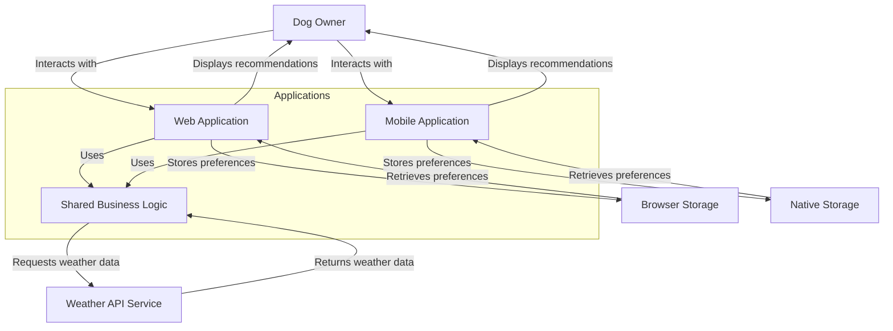
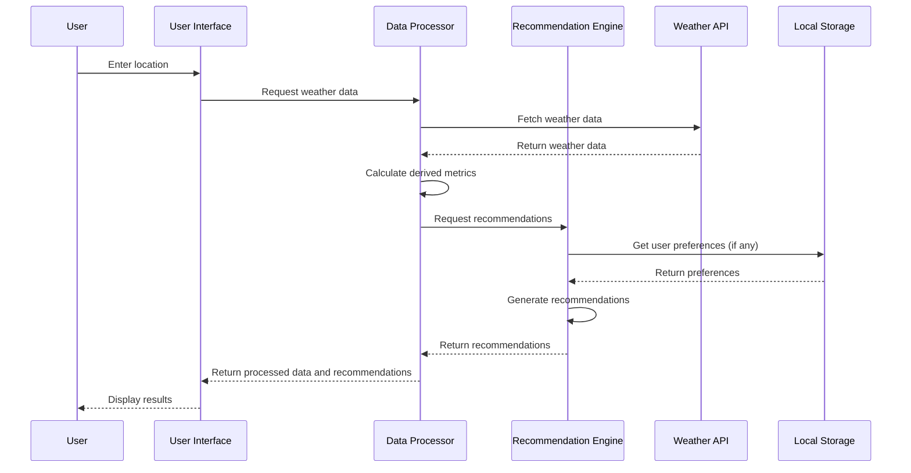

# Design Document: Can I Walk My Dog Today?

## Overview

The "Can I Walk My Dog Today?" application is a cross-platform tool that helps dog owners make informed decisions about exercising their dogs based on current weather conditions. The application considers multiple environmental factors that affect a dog's ability to regulate body temperature, providing science-based recommendations tailored to different activity levels.

This design document outlines the architecture, components, data models, and other technical aspects of the application, which will be available as both a web application and native mobile apps for iOS and Android.

## Architecture

The application will follow a serverless, cross-platform architecture using Next.js for web and React Native for mobile apps, with the following components:

1. **Frontend UI Layer**: 
   - Web: A responsive single-page application built with Next.js 15 and Tailwind CSS v4
   - Mobile: Native iOS and Android apps built with React Native and Expo
   - Shared UI components between platforms where possible

2. **Backend Layer**:
   - Next.js API routes with Edge Runtime for serverless API endpoints
   - Vercel for hosting and serverless function execution

3. **Data Processing Layer**: TypeScript modules that handle calculations, data transformations, and business logic, shared across platforms.

4. **External API Integration Layer**: Modules that handle communication with weather APIs, with TanStack Query for data fetching and caching.

5. **Storage Layer**: 
   - Web: Local storage and IndexedDB for client-side preferences
   - Mobile: AsyncStorage and SecureStore for mobile device storage
   - NeonDB serverless PostgreSQL with Drizzle ORM for persistent data storage

### System Context Diagram



## Components and Interfaces

### 1. User Interface Components

#### Mobile Widgets
- iOS home screen widget using WidgetKit
- Android home screen widget
- Quick access to current weather conditions and walking recommendations
- Widget configuration options

#### Location Input Component
- Search box for location entry
- Geolocation button for current location
- Recent/saved locations dropdown
- Validation and error display

#### Weather Metrics Display
- Temperature display
- Humidity display
- Heat index display
- Heat index score display
- Apparent temperature display
- WBGT display (if available)
- Visual indicators (color coding, progress bars)

#### Recommendations Panel
- General walking safety recommendations
- Activity-specific recommendations (Canicross, Bikejoring, Scooter/Rig)
- Safety level indicators
- Warning displays for unsafe conditions
- Explanatory tooltips/information

#### Forecast View
- Daily/hourly forecast toggle
- Timeline visualization
- Optimal walking time suggestions
- Warning indicators for dangerous periods

#### Educational Resources Section
- Information about heat risks for dogs
- Signs of heat stress and first aid
- References and further reading

#### Settings/Customization Panel
- Dog breed selection
- Coat type/color selection
- Age and health factors input
- Unit preferences (Celsius/Fahrenheit)

### 2. Data Processing Components

#### Weather Data Processor
- Retrieves and normalizes data from weather API
- Handles API errors and fallbacks
- Caches recent results

#### Calculation Engine
- Heat index calculator
- Heat index score calculator
- Apparent temperature calculator
- WBGT calculator (if data available)
- Safety threshold evaluator

#### Recommendation Engine
- Activity safety evaluator
- Dog-specific adjustment calculator (when customization is provided)
- Time-of-day optimizer for forecasts

#### Storage Manager
- Saves user preferences
- Manages location history
- Handles persistence of customization data

#### Monetization System
- Promo code validation and redemption
- In-app purchase processing (£1.99)
- Subscription status tracking
- Trial period management
- Admin interface for generating promo codes

### Component Interaction Diagram



## Data Models

### Weather Data Model
```javascript
{
  location: {
    name: String,
    lat: Number,
    lon: Number,
    timezone: String
  },
  current: {
    timestamp: Number,
    temperature: Number,
    humidity: Number,
    windSpeed: Number,
    solarRadiation: Number (optional)
  },
  calculated: {
    heatIndex: Number,
    heatIndexScore: Number,
    apparentTemperature: Number,
    wbgt: Number (optional)
  },
  forecast: [
    {
      timestamp: Number,
      temperature: Number,
      humidity: Number,
      windSpeed: Number,
      solarRadiation: Number (optional),
      calculated: {
        heatIndex: Number,
        heatIndexScore: Number,
        apparentTemperature: Number,
        wbgt: Number (optional)
      }
    }
  ]
}
```

### Recommendation Model
```javascript
{
  generalWalking: {
    safetyLevel: String, // "safe", "caution", "unsafe"
    recommendation: String,
    explanation: String
  },
  activities: {
    canicross: {
      safetyLevel: String,
      recommendation: String,
      explanation: String
    },
    bikejoring: {
      safetyLevel: String,
      recommendation: String,
      explanation: String
    },
    scooterRig: {
      safetyLevel: String,
      recommendation: String,
      explanation: String
    }
  },
  optimalTimes: [
    {
      startTime: Number,
      endTime: Number,
      safetyLevel: String
    }
  ]
}
```

### User Preferences Model
```javascript
{
  recentLocations: [
    {
      name: String,
      lat: Number,
      lon: Number
    }
  ],
  dogProfile: {
    breed: String (optional),
    coatType: String (optional),
    coatColor: String (optional),
    age: Number (optional),
    healthFactors: [String] (optional)
  },
  displayPreferences: {
    temperatureUnit: String, // "celsius", "fahrenheit"
    savedLocation: {
      name: String,
      lat: Number,
      lon: Number
    }
  }
}
```

## Calculation Formulas

### Heat Index Score
```
Heat Index Score = Humidity (%) × Temperature (°C)
```
- If score > 1000: Exercise caution, shorten distances and times

### Apparent Temperature
Based on the Australian Bureau of Meteorology formula:
```
AT = Ta + 0.33×e - 0.70×ws - 4.00
```
Where:
- AT = Apparent Temperature
- Ta = Dry bulb temperature (°C)
- e = Water vapor pressure (hPa)
- ws = Wind speed (m/s) at 10m elevation

### Activity Safety Thresholds

#### Canicross
- Safe: Apparent temperature < 18°C
- Caution (shortened distances/times): 18-21.5°C
- Unsafe: > 21.5°C

#### Bikejoring
- Safe: Apparent temperature < 15°C
- Caution (shortened distances/times): 15-17.5°C
- Unsafe: > 17.5°C

#### Scooter/Rig
- Safe: Apparent temperature < 10°C
- Caution (shortened distances/times): 10-14.5°C
- Unsafe: > 14.5°C

## Error Handling

### API Error Handling
1. Network connectivity issues: Display offline message, retry mechanism
2. API rate limiting: Implement backoff strategy, display appropriate message
3. Invalid location: Provide suggestions, clear error messages
4. Incomplete data: Use partial data where possible, indicate missing metrics

### Calculation Error Handling
1. Missing required parameters: Fall back to simpler calculations when possible
2. Out-of-range values: Clamp to valid ranges, display warning
3. Calculation failures: Log errors, display simplified recommendations

### User Input Validation
1. Location input: Validate against known locations/formats
2. Custom parameters: Validate ranges and formats
3. Form submissions: Client-side validation before processing

## Testing Strategy

### Unit Testing
1. Test calculation functions with known inputs and expected outputs
2. Test recommendation logic with various weather scenarios
3. Test data processing and transformation functions
4. Test storage and retrieval functions

### Integration Testing
1. Test API integration with mock responses
2. Test UI component interactions
3. Test end-to-end flows from location input to recommendation display

### User Testing
1. Test on various devices and screen sizes
2. Test with different browser versions
3. Test with real users for usability feedback

## Performance Considerations

1. Minimize API calls by caching recent results
2. Optimize calculations for performance
3. Implement lazy loading for non-critical components
4. Use efficient DOM manipulation techniques
5. Compress and minify assets
6. Consider implementing service workers for offline functionality

## Security Considerations

1. Validate all user inputs
2. Use HTTPS for API communications
3. Implement Content Security Policy
4. Avoid storing sensitive information in local storage
5. Sanitize any user-generated content before display

## Accessibility Considerations

1. Ensure proper contrast for color indicators
2. Provide alternative text for all visual indicators
3. Ensure keyboard navigation is supported
4. Test with screen readers
5. Follow WCAG 2.1 AA guidelines

## Deployment Strategy

### Web Deployment
1. Deploy Next.js application to Vercel
2. Configure custom domain and SSL certificates
3. Set up continuous deployment from Git repository
4. Configure environment variables for API keys and database connections

### Mobile Deployment
1. Configure iOS App Store deployment
   - Generate App Store Connect profile
   - Create app signing certificates and provisioning profiles
   - Prepare app store assets (icons, screenshots, descriptions)
   - Submit for App Store review

2. Configure Google Play Store deployment
   - Create Google Play Developer account
   - Generate signing keys for Android app
   - Prepare store listing assets
   - Submit for Google Play review

## Future Enhancements

1. Breed-specific recommendations
2. Heat acclimation factors
3. Integration with wearable dog temperature monitors
4. Community features (safe walking spots, water stations)
5. Push notifications for dangerous weather conditions
6. Integration with calendar for walk planning
7. Multi-language support
8. Dark mode support